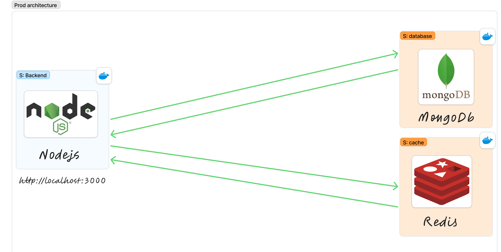
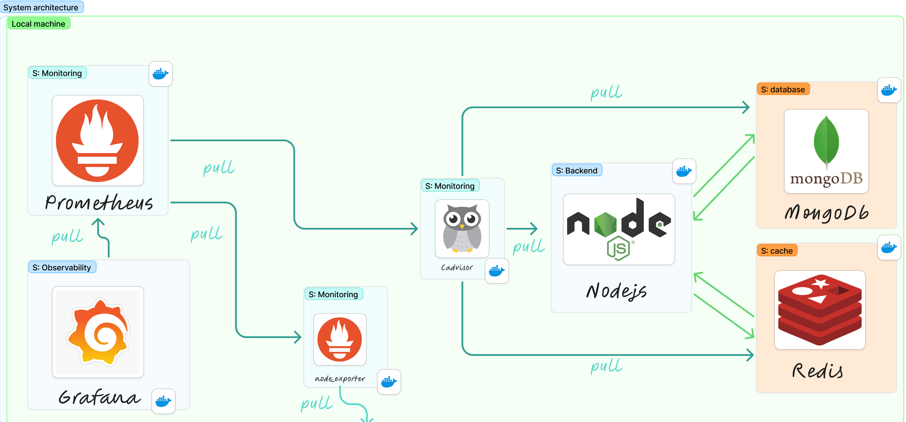

---

# From NoSQL module assignment To DevOps Lab

This project initially began as a simple **NoSQL module** assignment. Over time, it has been expanded into a **hands-on DevOps lab** that demonstrates containerization, advanced caching, and observability. 

> **Note:** The original exam requirements can be found in the **`exam-project-requirement`** branch.

## Table of Contents

1. [Overview](#overview)  
2. [Key Enhancements](#key-enhancements)  
3. [Architecture](#architecture)  
   1. [Minimal Setup](#minimal-setup)  
   2. [Full Monitoring Setup](#full-monitoring-setup)  
4. [Project Structure](#project-structure)  
5. [How to Run](#how-to-run)  
   1. [Development Mode](#development-mode)  
   2. [Production Mode](#production-mode)  
6. [API Endpoints](#api-endpoints)  
7. [Monitoring and Observability](#monitoring-and-observability)  
8. [Branch and Exam Requirements](#branch-and-exam-requirements)  

---

## Overview

- **Originally**: A basic project to fulfill a NoSQL module assignment, focusing on MongoDB and Redis integration.
- **Evolved**: A **DevOps-focused** lab illustrating:
  - **Docker containerization** for both development and production.
  - **Advanced caching** with Redis (including asynchronous Pub/Sub approaches).
  - **Full monitoring** stack using Prometheus, Grafana, node_exporter, cAdvisor, and redis_exporter.
  - **Network isolation** and environment-based configurations.

---

## Key Enhancements

Over several iterations, the project received the following significant updates (abstractly summarized):

1. **Docker Infrastructure**

   - Creation of separate Dockerfiles for development and production.
   - Introduction of a more modular Compose setup, with profiles to toggle monitoring, dev vs. prod services, and additional tooling.

2. **Caching Mechanisms**

   - Shift from simple key-value storage to Redis Hash usage for certain entities.
   - Implementation of asynchronous cache refresh through Redis Pub/Sub, offloading heavy operations to a background worker.

3. **Monitoring Stack**

   - Integration of **Prometheus** for metric scraping and **Grafana** for dashboard visualization.
   - Addition of exporters like **node_exporter** (system metrics), **cAdvisor** (container metrics), and **redis_exporter** (Redis metrics).
   - Automated provisioning of Grafana datasources and dashboards for a GitOps-friendly approach.

4. **Network and Security**

   - Configuration of multiple Docker networks (public vs. private) to limit the exposure of sensitive services.
   - Restriction of certain monitoring services to private networks.
   - Optional inclusion of **RedisInsight** in development mode only.

5. **Refined Directory Structure**
   - Relocation of all Docker-related files under a dedicated `docker/` directory (subfolders for `app`, `monitoring`, `redis`, etc.).
   - Clearer boundaries between app code, infrastructure code, and environment configuration.

---

## Architecture

### Minimal Setup

The simplest form of the application comprises:

- **Node.js** backend
- **MongoDB** database
- **Redis** cache



### Full Monitoring Setup

A more advanced configuration adds:

- **Prometheus** (metrics collection)
- **Grafana** (metrics visualization)
- **node_exporter**, **cAdvisor**, **redis_exporter** for system, container, and Redis metrics



---

## Project Structure

A high-level view of the directories and files:

```
.
├── docker
│   ├── app
│   │   ├── Dockerfile
│   │   └── Dockerfile.dev
│   ├── compose.yml
│   ├── monitoring
│   │   ├── grafana
│   │   │   ├── dashboards
│   │   │   ├── datasources
│   │   │   └── provisioning
│   │   └── prometheus
│   └── redis
├── public
│   └── screenshots
├── src
│   ├── api-docs.yaml
│   ├── app.js
│   ├── config
│   ├── controllers
│   ├── middlewares
│   ├── routes
│   ├── services
│   └── workers
├── .env
├── README.md
└── ...
```

---

## How to Run

### Development Mode

This mode mounts local source code into the container for quick iteration:

```bash
docker compose -f docker/compose.yml down &&   docker compose -f docker/compose.yml --profile dev up --build
```

- Node.js API is available at **http://localhost:3000**.
- **redisinsight** (optional for dev) is at **http://localhost:5555**.

### Production Mode

For a production-like setup with minimal image size and no code mounting:

```bash
docker compose -f docker/compose.yml down &&   docker compose -f docker/compose.yml --profile prod up --build
```

- Node.js API remains at **http://localhost:3000**.
- Monitoring services start, but might be on private networks by default.

---

## API Endpoints

The legacy NoSQL endpoints still exist for demonstration purposes:

- **Courses**

  - `POST /api/courses` – Create a new course
  - `GET /api/courses` – Retrieve all courses
  - `GET /api/courses/:id` – Retrieve a specific course by ID
  - `GET /api/courses/stats` – Get basic course statistics

- **Students**
  - `POST /api/students` – Create a new student
  - `GET /api/students` – Retrieve all students
  - `GET /api/students/:id` – Retrieve a specific student by ID

### Testing with Swagger UI

When the application is running, you can explore the API in your browser:

- Navigate to: **http://localhost:3000/api-docs**

Here’s an example of the OpenAPI (Swagger) interface:


You can test endpoints directly by expanding them and filling in the required parameters or JSON bodies. For instance, creating a new course:

1. Click on `POST /api/courses`.
2. Click **Try it out**.
3. Provide the course data in JSON format.
4. Click **Execute** to send the request and view the response.

---

## Monitoring and Observability

With the monitoring profile enabled:

- **Prometheus** scrapes metrics from:
  - `node_exporter` (system-level metrics)
  - `cAdvisor` (Docker container metrics)
  - `redis_exporter` (Redis-specific metrics)
- **Grafana** provides pre-built dashboards (persisted in JSON/YAML files) for quick visualization.

By default, these services may be in a private network. Adjust the `ports:` in the Compose file if you want local access.

---

## Branch and Exam Requirements

- The original **exam requirements** can be found in the **`exam-project-requirement`** branch.
- The **main** branch showcases the **DevOps lab** with advanced features.

---

### Conclusion

This repository demonstrates how a straightforward Node.js + MongoDB + Redis app can evolve into a robust **DevOps lab**. By exploring Docker containerization, advanced caching, and a monitoring stack, you can learn a variety of best practices in one place.