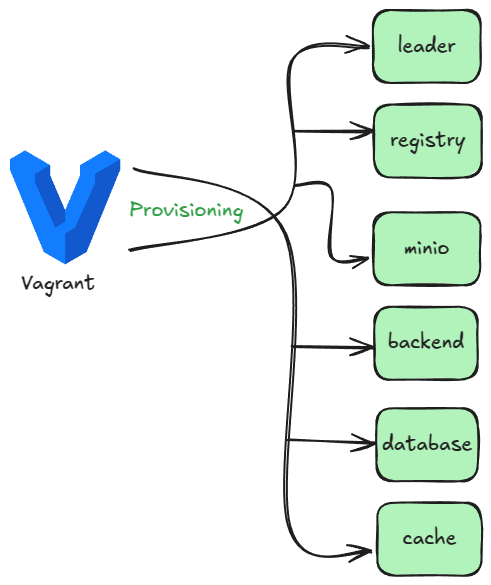
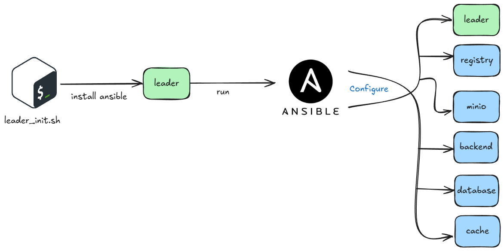
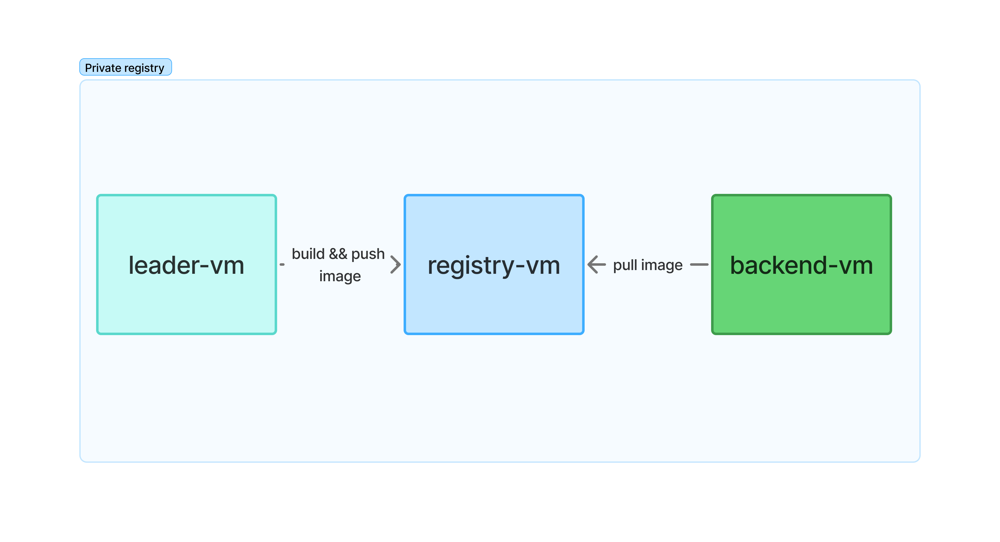
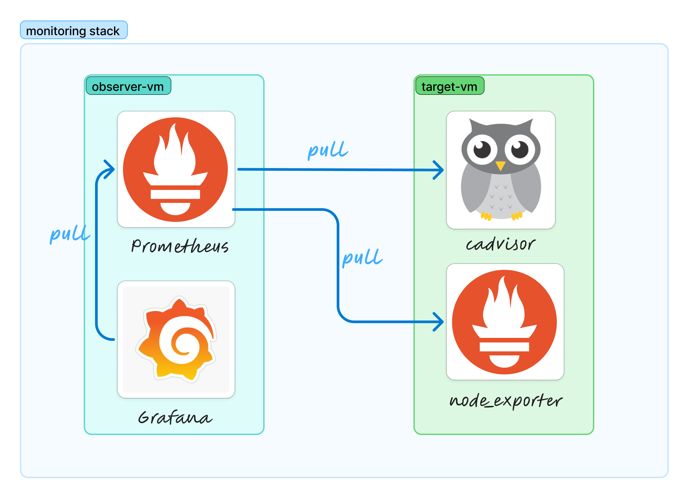
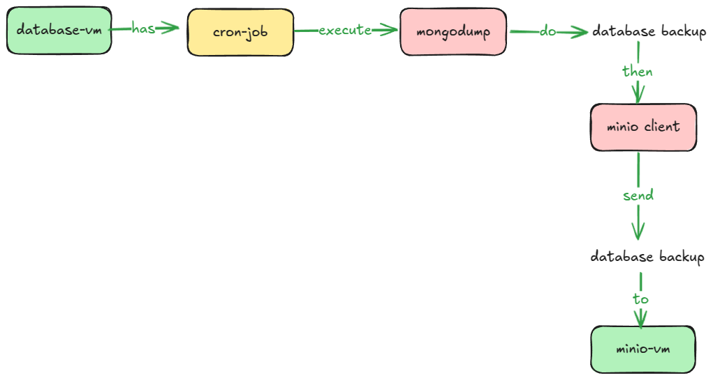
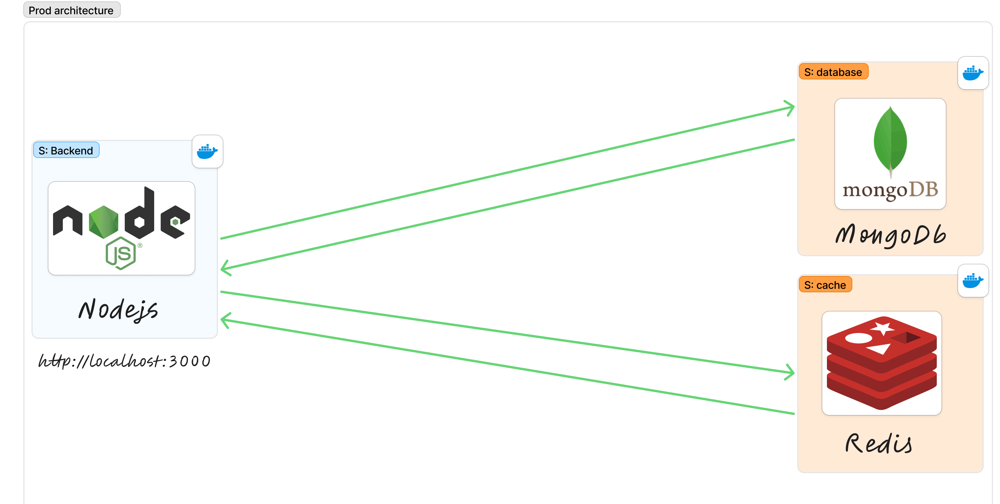

---

# DevOps Lab - Infrastructure as Code Deployment

## Purpose

This project is designed for learning purposes, demonstrating the incremental development of an infrastructure as code (IaC) deployment. Each branch contains its own motivations and README, focusing on specific aspects of the system:

- **monitoring-system**: Dedicated to the implementation and configuration of the monitoring system.
- **infra-as-code**: Emphasizes the infrastructure as code principles and practices.

The main branch presents the current state of the project, with each pull request (PR) adding new concepts and addressing issues from previous iterations. You can track each change in the commits section.

## Summary

The motivation behind this increment is to transition from an infrastructure where all components are containers within a single VM to a more robust setup. In this new setup, each service operates within its own VM, complete with automated configuration and provisioning. This approach enhances scalability, security, and manageability, aligning with best practices in infrastructure as code (IaC).

## Complete System Design


Our complete infrastructure consists of 6 specialized VMs with secure networking:

1. **Core Services**:

   - Backend (Node.js application)
   - Database (MongoDB)
   - Cache (Redis)

2. **Infrastructure Services**:

   - Leader (Ansible control node)
   - Private Registry (Docker image storage)
   - MinIO (Object storage for backups)

3. **Security**:

   - UFW firewall with default deny policy
   - Service-specific allow rules
   - Isolated network (192.168.56.0/24)

4. **Monitoring**:
   - Prometheus + Grafana on leader
   - cAdvisor + node_exporter on all targets

## Component Breakdown

### 1. Provisioning System



- Vagrant-managed virtual machines
- Static IP assignment (192.168.56.10-15)
- Base Ubuntu image for all VMs

| VM       | IP            | Purpose                      |
| -------- | ------------- | ---------------------------- |
| database | 192.168.56.10 | MongoDB with backup to MinIO |
| cache    | 192.168.56.11 | Redis cache service          |
| backend  | 192.168.56.12 | Node.js application          |
| leader   | 192.168.56.13 | Ansible control + monitoring |
| registry | 192.168.56.14 | Private Docker registry      |
| minio    | 192.168.56.15 | S3-compatible object storage |

### 2. Configuration Management



- **Leader VM** executes `leader-init.sh` to:
  - Install Ansible
  - Run playbooks to configure:
    - Itself (monitoring stack)
    - All other VMs (services + firewall)

### 3. Private Registry Flow



1. Leader builds Docker images from source
2. Images pushed to registry VM (192.168.56.14:5000)
3. Backend VM pulls images for deployment

### 4. Monitoring Stack



- **Scraping**: Leader (Prometheus) collects from:
  - node_exporter (9100) - system metrics
  - cAdvisor (9101) - container metrics
- **Visualization**: Grafana on leader (3001)

### 5. Database Backup System



- Daily `mongodump` cron job on database VM
- MinIO client (`mc`) transfers backups to:
  - `minio://192.168.56.15/backups`

## Core Application Components



The essential services that power the application:

```ruby
SERVICES = {
  'database' => { ip: '192.168.56.10', ports: { 27017 => 27017 } },
  'cache' => { ip: '192.168.56.11', ports: { 6379 => 6379 } },
  'backend' => { ip: '192.168.56.12', ports: { 3000 => 3000 } }
}
```

## API Endpoints

- **Courses**

  - `POST /api/courses` – Create a new course
  - `GET /api/courses` – Retrieve all courses
  - `GET /api/courses/:id` – Retrieve a specific course by ID
  - `GET /api/courses/stats` – Get basic course statistics

- **Students**
  - `POST /api/students` – Create a new student
  - `GET /api/students` – Retrieve all students
  - `GET /api/students/:id` – Retrieve a specific student by ID

### Testing with Swagger UI

When the application is running, you can explore the API in your browser:

- Navigate to: **http://localhost:3000/api-docs**

Here’s an example of the OpenAPI (Swagger) interface:


You can test endpoints directly by expanding them and filling in the required parameters or JSON bodies. For instance, creating a new course:

1. Click on `POST /api/courses`.
2. Click **Try it out**.
3. Provide the course data in JSON format.
4. Click **Execute** to send the request and view the response.

## Directory Structure

```
.
├── docker
│   ├── app
│   │   ├── Dockerfile
│   │   └── Dockerfile.dev
│   ├── compose.yml
│   ├── monitoring
│   │   ├── grafana
│   │   │   ├── dashboards
│   │   │   ├── datasources
│   │   │   └── provisioning
│   │   └── prometheus
│   │       └── prometheus.yml
│   └── redis
│       └── redis.conf
├── infra
│   ├── ansible
│   │   ├── group_vars
│   │   │   └── all.yml
│   │   ├── hosts
│   │   ├── playbook.yml
│   │   ├── roles
│   │   │   ├── build_and_push
│   │   │   ├── common
│   │   │   ├── docker
│   │   │   ├── minio
│   │   │   ├── mongo
│   │   │   ├── mongo_backup
│   │   │   ├── observer
│   │   │   ├── pull_and_run
│   │   │   ├── redis
│   │   │   ├── registry
│   │   │   └── target
│   │   └── templates
│   │       └── redis.conf.j2
│   └── vagrant
│       └── Vagrantfile
├── leader_init.sh
├── package.json
├── package-lock.json
├── public
│   ├── diagrams
│   │   ├── basic-system.png
│   │   ├── configuration.png
│   │   ├── database-backup.png
│   │   ├── monitoring-stack.jpg
│   │   ├── monitoring_system.png
│   │   ├── private-registry.jpg
│   │   ├── provisioning.png
│   │   └── system-design.jpg
│   └── screenshots
│       ├── swagger-ui-add-new-course-1.png
│       ├── swagger-ui-add-new-course-2.png
│       └── swagger-ui.png
├── README.md
|── src
    ├── api-docs.yaml
    ├── app.js
    ├── config
    │   ├── db.js
    │   ├── env.js
    │   └── swagger.js
    ├── controllers
    │   ├── courseController.js
    │   └── studentController.js
    ├── middlewares
    │   └── requestTimer.js
    ├── routes
    │   ├── courseRoutes.js
    │   └── studentRoutes.js
    ├── services
    │   ├── mongoService.js
    │   └── redisService.js
    └── workers
        └── cacheWorker.js
```

---