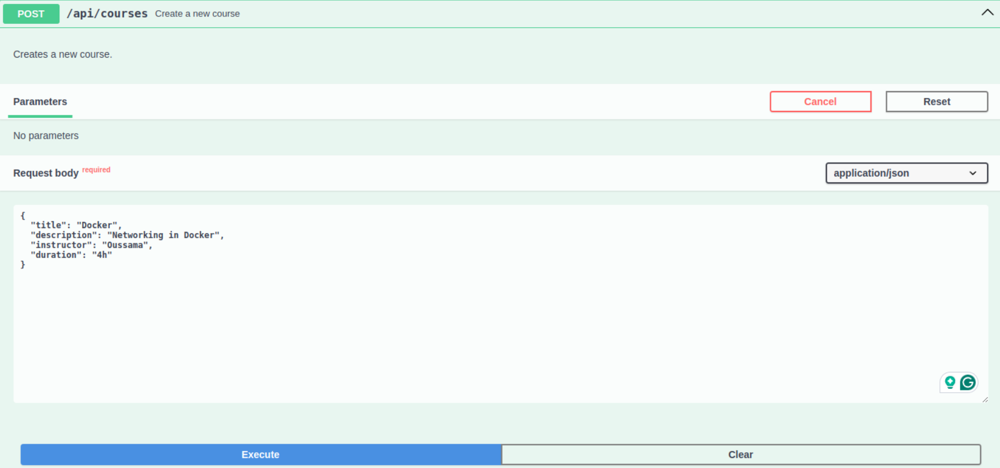
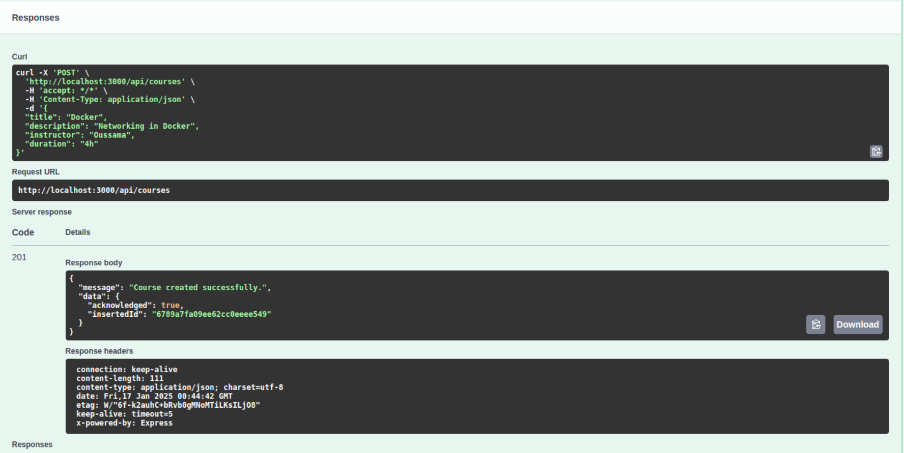

# Projet de fin de module NoSQL

La procédure pour entamer ce projet consiste à analyser différentes parties de celui-ci.

## Comment utiliser ce projet

### Prérequis

Ce projet nécessite uniquement **Docker** pour fonctionner.

### Étapes pour démarrer

1. **Clonez ce projet**
   Clonez le dépôt Git sur votre machine locale :

   ```bash
   git clone https://github.com/Oussama-El-Amrani/learning-platform-nosql.git
   ```

2. **Lancer l'application avec Docker Compose**

   Il suffit d'exécuter la commande suivante pour démarrer tous les services nécessaires (MongoDB, Redis, l'application et RedisInsight) :

   ```bash
   docker-compose up --build
   ```

   Cette commande construira les images Docker et démarrera les services définis dans le fichier `docker-compose.yml`.

3. **Accéder à l'application**

   Une fois les services démarrés, l'API sera accessible à l'adresse suivante : 

   ```
   http://localhost:3000
   ```

   Vous pouvez également accéder à l'interface RedisInsight pour gérer Redis via : 

   ```
   http://localhost:5555
   ```
## Configuration du projet

Le projet possède deux configurations principales pour la base de données : MongoDB et Redis. Les services sont principalement utilisés dans le contrôleur, et les routes sont définies comme suit :

### Endpoints des routes

- `POST /api/courses`: Créer un nouveau cours
- `GET /api/courses`: Récupérer tous les cours
- `GET /api/courses/stats`: Récupérer les statistiques des cours
- `GET /api/courses/:id`: Récupérer un cours par son ID

- `POST /api/students`: Créer un nouvel étudiant
- `GET /api/students`: Récupérer tous les étudiants
- `GET /api/students/:id`: Récupérer un étudiant par son ID

### Pour plus de détails sur la procédure, référez-vous aux commits.

---

### cURL Commands pour tester les Endpoints

#### 1. **Créer un nouveau cours**

Pour créer un nouveau cours, utilisez la requête `POST` suivante :

```bash
curl -X POST http://localhost:3000/api/courses \
  -H "Content-Type: application/json" \
  -d '{
        "title": "Introduction to Docker",
        "description": "Apprenez à containeriser des applications avec Docker et améliorez votre flux de travail",
        "instructor": "Alex Johnson",
        "duration": "4 semaines"
      }'
```

#### 2. **Créer un autre cours**

```bash
curl -X POST http://localhost:3000/api/courses \
  -H "Content-Type: application/json" \
  -d '{
        "title": "Intégration Continue avec Jenkins",
        "description": "Maîtrisez les principes du CI/CD et automatisez les tests et déploiements avec Jenkins",
        "instructor": "Sarah Lee",
        "duration": "6 semaines"
      }'
```

#### 3. **Créer encore un autre cours**

```bash
curl -X POST http://localhost:3000/api/courses \
  -H "Content-Type: application/json" \
  -d '{
        "title": "Kubernetes pour les environnements de production",
        "description": "Apprenez à gérer et mettre à l'échelle des applications containerisées en production avec Kubernetes",
        "instructor": "Daniel Green",
        "duration": "8 semaines"
      }'
```

#### 4. **Créer un nouvel étudiant**

Pour créer un nouvel étudiant, utilisez la requête `POST` suivante :

```bash
curl -X POST http://localhost:3000/api/students \
  -H "Content-Type: application/json" \
  -d '{
        "firstName": "Oussama",
        "lastName": "EL-AMRANI",
        "email": "elamranioussama01@gmail.com",
        "phoneNumber": "1234567890"
      }'
```

#### 5. **Récupérer tous les étudiants**

Pour récupérer tous les étudiants, utilisez la requête `GET` suivante :

```bash
curl -X GET http://localhost:3000/api/students
```

#### 6. **Récupérer un étudiant spécifique par ID**

Pour récupérer un étudiant par son ID, utilisez la requête `GET` suivante avec l'ID de l'étudiant (par exemple, `677ae2218dd6c55b4765b4b6`) :

```bash
curl -X GET http://localhost:3000/api/students/677ae2218dd6c55b4765b4b6
```

#### 7. **Récupérer les statistiques des cours**

Pour récupérer les statistiques des cours, utilisez la requête `GET` suivante :

```bash
curl -X GET http://localhost:3000/api/courses/stats
```

Cette requête retournera des informations comme le nombre total de cours et la durée moyenne des cours.

## Documentation Swagger et UI

L'API est également documentée via Swagger pour faciliter la compréhension et l'utilisation. Vous pouvez tester les endpoints directement via l'interface Swagger UI en accédant à :

- **URL Swagger UI**: [http://localhost:3000/api-docs](http://localhost:3000/api-docs)

Cette interface vous permettra de voir tous les endpoints, de tester les différentes routes avec des exemples et de recevoir des retours détaillés sur les réponses de l'API.


**Créer un nouveau cours**


---

## Questions sur les Routes (courseRoutes.js)

- **Pourquoi séparer les routes dans différents fichiers ?**

  Séparer les routes dans différents fichiers permet de respecter le principe de responsabilité unique (Single Responsibility Principle). Chaque fichier gère un ensemble cohérent de routes, ce qui facilite la maintenance, améliore la lisibilité et permet de travailler sur des fonctionnalités spécifiques sans affecter d'autres parties du code.
- **Comment organiser les routes de manière cohérente ?**

  Les routes peuvent être organisées par ressource ou par fonctionnalité. Par exemple, toutes les routes liées aux cours seraient dans `courseRoutes.js`, celles liées aux Étudiant dans `studentRoutes.js`. Il est également utile de regrouper les routes avec des préfixes communs (ex. `/api/courses` ou `/api/students`) pour plus de clarté et de logique.

## Questions sur les Contrôleurs (courseController.js)

- **Quelle est la différence entre un contrôleur et une route ?**

  Une route sert à définir l'URL et la méthode HTTP (GET, POST, etc.) pour une action spécifique. Un contrôleur contient la logique métier qui traite la requête associée. En résumé, la route redirige les requêtes vers le contrôleur, et le contrôleur exécute les actions nécessaires.
- **Pourquoi séparer la logique métier des routes ?**

  Séparer la logique métier des routes permet de rendre le code plus lisible, maintenable et réutilisable. Les routes restent simples et uniquement dédiées à la gestion des URLs, tandis que la logique métier est centralisée dans les contrôleurs, où elle peut être testée et mise à jour indépendamment.

## Questions sur les Variables d'Environnement (env.js)

- **Pourquoi est-il important de valider les variables d'environnement au démarrage ?**

  Valider les variables d'environnement au démarrage permet de garantir que l'application dispose des paramètres nécessaires pour fonctionner correctement. Une validation précoce évite des erreurs imprévues pendant l'exécution et permet de diagnostiquer les problèmes rapidement.
- **Que se passe-t-il si une variable requise est manquante ?**

  Si une variable requise est manquante, l'application risque de ne pas fonctionner correctement ou de s'arrêter. Par exemple, sans la chaîne de connexion à la base de données, le serveur ne pourra pas interagir avec celle-ci, ce qui pourrait rendre une partie de l'application inutilisable.

## Questions sur la Base de Données (db.js)

- **Pourquoi créer un module séparé pour les connexions aux bases de données ?**

  Créer un module séparé centralise la gestion des connexions à la base de données. Cela facilite la réutilisation, l'évolutivité (ajout de nouvelles bases) et l'application de bonnes pratiques (par ex., connexion et déconnexion).
- **Comment gérer proprement la fermeture des connexions ?**

  Il est important de gérer la fermeture des connexions en capturant les événements d'arrêt de l'application (SIGINT, SIGTERM) et en appelant explicitement la méthode de déconnexion du client de base de données. Cela évite les fuites de ressources et garantit une fermeture propre.

## Questions sur Redis (redisService.js)

- **Comment gérer efficacement le cache avec Redis ?**

  Une gestion efficace du cache avec Redis repose sur l'utilisation de délais d'expiration (TTL) pour limiter la durée de vie des données en cache. Il est également crucial d'invalider ou mettre à jour les clés lorsque les données correspondantes changent dans la base principale, afin de garantir la cohérence.
- **Quelles sont les bonnes pratiques pour les clés Redis ?**

  - Utiliser une structure hiérarchique dans les noms de clés (ex. `student:123:profile`) pour une organisation claire.
  - Privilégier des noms explicites et uniques pour éviter les collisions.
  - Ajouter un TTL aux clés pour éviter une utilisation excessive de la mémoire.

## Questions sur les Services (mongoService.js)

- **Pourquoi créer des services séparés ?**

  Les services permettent de centraliser et d'encapsuler la logique d'accès aux données ou aux APIs tierces. Cela améliore la réutilisabilité, facilite les tests unitaires, et rend le code plus clair en séparant les responsabilités (par ex., la logique métier est séparée des interactions avec la base).

---
