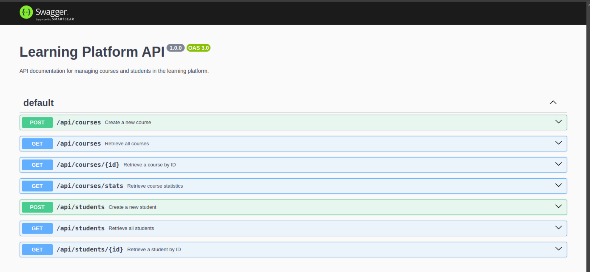

# Projet de fin de module NoSQL

La procédure pour entamer ce projet consiste à analyser différentes parties de celui-ci.

## Configuration du projet

Le projet possède deux configurations principales pour la base de données : MongoDB et Redis. Les services sont principalement utilisés dans le contrôleur, et les routes sont définies comme suit :

### Endpoints des routes

- `POST /api/courses`: Créer un nouveau cours
- `GET /api/courses`: Récupérer tous les cours
- `GET /api/courses/stats`: Récupérer les statistiques des cours
- `GET /api/courses/:id`: Récupérer un cours par son ID

- `POST /api/students`: Créer un nouvel étudiant
- `GET /api/students`: Récupérer tous les étudiants
- `GET /api/students/:id`: Récupérer un étudiant par son ID

### Pour plus de détails sur la procédure, référez-vous aux commits.

---

### cURL Commands pour tester les Endpoints

#### 1. **Créer un nouveau cours**

Pour créer un nouveau cours, utilisez la requête `POST` suivante :

```bash
curl -X POST http://localhost:3000/api/courses \
  -H "Content-Type: application/json" \
  -d '{
        "title": "Introduction to Docker",
        "description": "Apprenez à containeriser des applications avec Docker et améliorez votre flux de travail",
        "instructor": "Alex Johnson",
        "duration": "4 semaines"
      }'
```

#### 2. **Créer un autre cours**

```bash
curl -X POST http://localhost:3000/api/courses \
  -H "Content-Type: application/json" \
  -d '{
        "title": "Intégration Continue avec Jenkins",
        "description": "Maîtrisez les principes du CI/CD et automatisez les tests et déploiements avec Jenkins",
        "instructor": "Sarah Lee",
        "duration": "6 semaines"
      }'
```

#### 3. **Créer encore un autre cours**

```bash
curl -X POST http://localhost:3000/api/courses \
  -H "Content-Type: application/json" \
  -d '{
        "title": "Kubernetes pour les environnements de production",
        "description": "Apprenez à gérer et mettre à l'échelle des applications containerisées en production avec Kubernetes",
        "instructor": "Daniel Green",
        "duration": "8 semaines"
      }'
```

#### 4. **Créer un nouvel étudiant**

Pour créer un nouvel étudiant, utilisez la requête `POST` suivante :

```bash
curl -X POST http://localhost:3000/api/students \
  -H "Content-Type: application/json" \
  -d '{
        "firstName": "Oussama",
        "lastName": "EL-AMRANI",
        "email": "elamranioussama01@gmail.com",
        "phoneNumber": "1234567890"
      }'
```

#### 5. **Récupérer tous les étudiants**

Pour récupérer tous les étudiants, utilisez la requête `GET` suivante :

```bash
curl -X GET http://localhost:3000/api/students
```

#### 6. **Récupérer un étudiant spécifique par ID**

Pour récupérer un étudiant par son ID, utilisez la requête `GET` suivante avec l'ID de l'étudiant (par exemple, `677ae2218dd6c55b4765b4b6`) :

```bash
curl -X GET http://localhost:3000/api/students/677ae2218dd6c55b4765b4b6
```

#### 7. **Récupérer les statistiques des cours**

Pour récupérer les statistiques des cours, utilisez la requête `GET` suivante :

```bash
curl -X GET http://localhost:3000/api/courses/stats
```

Cette requête retournera des informations comme le nombre total de cours et la durée moyenne des cours.

## Documentation Swagger et UI

L'API est également documentée via Swagger pour faciliter la compréhension et l'utilisation. Vous pouvez tester les endpoints directement via l'interface Swagger UI en accédant à :

- **URL Swagger UI**: [http://localhost:3000/api-docs](http://localhost:3000/api-docs)

Cette interface vous permettra de voir tous les endpoints, de tester les différentes routes avec des exemples et de recevoir des retours détaillés sur les réponses de l'API.


---

## Questions sur les Routes (courseRoutes.js)

- **Pourquoi séparer les routes dans différents fichiers ?**
- **Comment organiser les routes de manière cohérente ?**

## Questions sur les Contrôleurs (courseController.js)

- **Quelle est la différence entre un contrôleur et une route ?**
- **Pourquoi séparer la logique métier des routes ?**

## Questions sur les Variables d'Environnement (env.js)

- **Pourquoi est-il important de valider les variables d'environnement au démarrage ?**
- **Que se passe-t-il si une variable requise est manquante ?**

## Questions sur la Base de Données (db.js)

- **Pourquoi créer un module séparé pour les connexions aux bases de données ?**
- **Comment gérer proprement la fermeture des connexions ?**

## Questions sur Redis (redisService.js)

- **Comment gérer efficacement le cache avec Redis ?**
- **Quelles sont les bonnes pratiques pour les clés Redis ?**

## Questions sur les Services (mongoService.js)

- **Pourquoi créer des services séparés ?**

---
